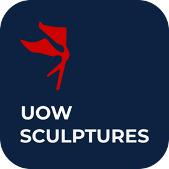

<p align="center">
  
</p>

## Description

API backend for UOW Sculpture, an application that allow visitors to view information and locate sculptures in the UOW 
Art Collection. There is also a web app for the UOW Art Collection manager to manage sculpture information

This application were built using the [NestJS](http://nestjs.com/) framework

## Installation

### Prerequisite

Create a `.env` file (See `.env.example` for the shape of the file). Fill in necessary env variables

### Install dependencies:

```bash
$ npm install
```

## Running the app

```bash
# production
$ npm run start

# development mode (watch enabled)
$ npm run start:dev
```

## Test

```bash
# unit tests
$ npm run test
```

